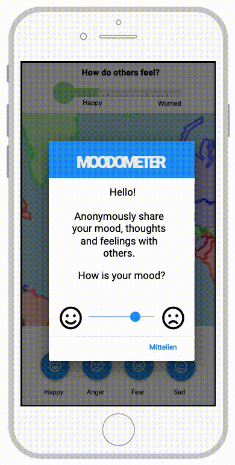

**********************
Click Proto Moodometer
**********************

This is the click prototype for the web app 'Moodometer' that was created during the 2020 #wirvsvirus hackathon.
It is an export of a project on proto.io (`clickable prototype <https://share.proto.io/HO4MPF/>`_). The Project is also hosted on `DevPost <https://devpost.com/software/01_038_daten_worldwidesocialathmospheredatabase>`_.

|Substitution Name|

Run
###
It has to be run with chrom set to iPhone 8 in the dev tools device options.

Inspiration (german)
####################
Durch das Coronavirus müssen die Menschen weltweit ihren gewohnten Lebensstil in nie dagewesener Form ändern. Dazu gehört auch die Einschränkung jeglicher sozialen Aktivität aufgrund von Social Distancing, wodurch eine Verbreitung des Virus verlangsamt werden soll. Dadurch wird allerdings das menschliche Bedürfnis nach sozialem Austausch nicht mehr erfüllt, welches besonders in von Unsicherheit geprägten Zeiten größer den je ist. Unsicherheit, Angst, soziale Isolation - wie geht es mit und nach Corona weiter? Kommt es zur Rezession? Schwindet der soziale Zusammenhalt? Wohin mit meinen Sorgen und was kann ich dagegen tun? Wir wollen den Menschen eine Plattform geben.

What it does (german)
#####################
Moodometer hilft den Menschen in Deutschland und auf der ganzen Welt, ihre aktuellen Gefühle, zum Beispiel, Sorgen und Nöte mitzuteilen, gemeinsam zu ordnen und Ratschläge zur Bewältigung zu finden - ohne dabei die vielen schönen Dinge des Lebens aus dem Blick zu verlieren. Die Plattform verfolgt den Grundsatz „Geteiltes Leid ist halbes Leid“ und nimmt die aktuelle Stimmungslage sowie Emotionen wie Angst, Wut, Trauer und Freude der Anwender entgegen und stellt sie in den Vergleich mit allen anderen. Darüber hinaus bietet sie crowdbasierte Unterstützung bei der Bewältigung. Bekommen wir die Möglichkeit, uns mit anderen über unsere Ängste auszutauschen oder sehen, dass es allen anderen auch nicht besser geht, fühlen wir uns sofort getröstet. Mit konkreten Vorschlägen gegen die Angst zeigt sich ein Licht im Tunnel, das wir alle in diesen Tagen so dringend brauchen. Zugehörigkeit und Zusammenhalt auch mit Social Distancing!
